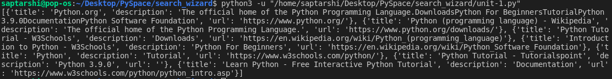
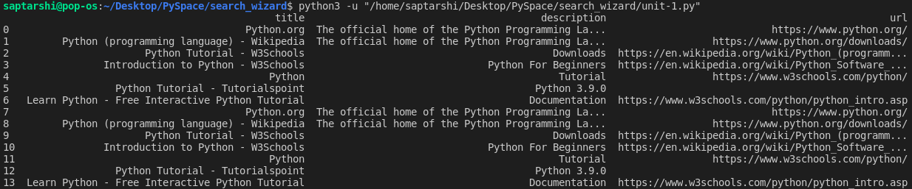

# search_wizard

A WebScrapper tool for finding search results for a particular topic.

## Usage

- ### Installing dependencies ...

  ```bash
  $ pip install -r requirements.txt
  ```

  - after cloning the repository run this command in root folder.

- ### Using SearchWizard ...

  - Import SearchWizard
    ```py
    from search_wizard import SearchWizard
    ```
  - #### SearchWizard(**_query_**: optional)

    - mention your search query in parameters (optional)
    - get_results(**_query_**: optional, flag: optional)->list

    **you must have to put your `search query` in either of the two parameters.**

    ```py
    results = SearchWizard("python").get_results()
    print(results)
    ```

    or

    ```py
    results = SearchWizard().get_results(query="python")
    print(results)
    ```

    ## O/P ...

      

    ## **Felt messy?** dont worry I've heard you!

    - prettify(flag: optional)

    ```py
    sw=SearchWizard()
    sw.get_results(query = "python")
    sw.prettify()
    ```

    ## O/P ..

      

    ## **_Wanna depreciate some results?_** get the top and bottom results ny using a flag 🚩

    - flag = "head" or "tail"

      - "head" : get the top 3 results
      - "tail" : get the last 3 bottom most results

      - ## Usage
        - get*results(query: optional, **_flag_**: optional)
        ```py
        SearchWizard().get_results(query = "python", flag = "head")
        ```
        or
        - prettify(**_flag_**: optional)
        ```py
        SearchWizard("python").prettify("tail")
        ```
